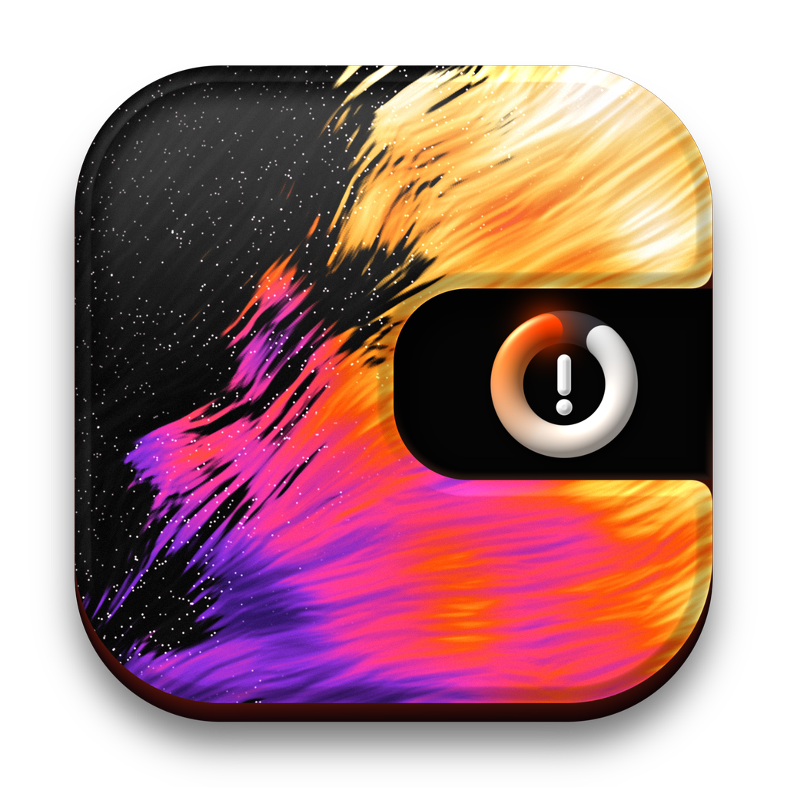

<p align="center"></p>

<h1 align="center">iPanicX</h1>

<p align="center">Find out why an iPhone keeps restarting.</p>

---

iPanicX is a desktop app for **Windows** and **macOS**. Plug in an iPhone
over USB and it reads the device's crash reports, explains its **kernel
panics** in plain language and points to the part that is most likely
faulty.

- **Health check**: battery, storage, kernel panics, app crashes, memory,
  temperature and more, each marked OK / attention / problem.
- **Panic diagnosis**: matches each panic against a knowledge base and
  names the suspected part (for example the charging port flex).
- **Correlation**: spots the same hardware clue repeated across panics.
- **Live console**: the iPhone's log in real time, important lines
  explained.
- **Reports**: export a plain-text report to share with a customer or a
  colleague.
- English and French.

**100 % local.** No account, no analytics, no telemetry. Diagnostics never
leave your computer. The only network request is the update check: at most
once a day, iPanicX asks GitHub for its latest release (it can be turned off
in **General › Updates**).

**Automatic updates.** When a new version is out, iPanicX shows it in the
sidebar; *Install and Restart* downloads it, checks its SHA-256 checksum,
replaces the app and restarts it (Windows and macOS).

## Download

Get the latest version from
**[Releases](https://github.com/brunopaiva15/iPanicX/releases)**.

| | File | Notes |
|---|---|---|
| Windows 10/11 | `iPanicX-…-windows-x64.zip` | Unzip, run `iPanicX.exe`. Requires **Apple Devices** from the Microsoft Store (or iTunes) for the iPhone USB driver. |
| macOS 12+ | `iPanicX-…-macos.dmg` | Drag iPanicX to Applications. The bundled tools run on Apple Silicon; on Intel Macs run `brew install libimobiledevice`. |

The app is not signed yet, so the system warns on first launch:

- **Windows**: SmartScreen → *More info* → *Run anyway*.
- **macOS**: open it once, then *System Settings → Privacy & Security →
  Open Anyway*.

## Use

1. Connect the iPhone with a USB cable, unlock it, tap **Trust**.
2. Click **Scan Diagnostics**.
3. Open **Health** for the overview, or any panic for its diagnosis.

If the iPhone is not detected, the app tells you why (missing Apple
driver, service stopped, cable…) and what to do.

## Build from source

Requires [Flutter](https://docs.flutter.dev/get-started/install) (stable).

```bash
flutter pub get
flutter run -d windows   # or: -d macos
```

Try it without an iPhone:

```bash
flutter run -d windows --dart-define=USE_MOCK_DEVICE=true
```

Developer documentation (architecture, knowledge base, tests), in French:
[docs/DEVELOPMENT.md](docs/DEVELOPMENT.md).

## Good to know

- A diagnosis is based on known panic signatures and should always be
  confirmed by hardware inspection.
- Values iOS does not expose are shown as *Not available*, never guessed.
- Device access uses the open-source
  [libimobiledevice](https://libimobiledevice.org) tools (LGPL-2.1).
  Design inspired by [Codenotch](https://github.com/vinzdg/codenotch) (MIT).
